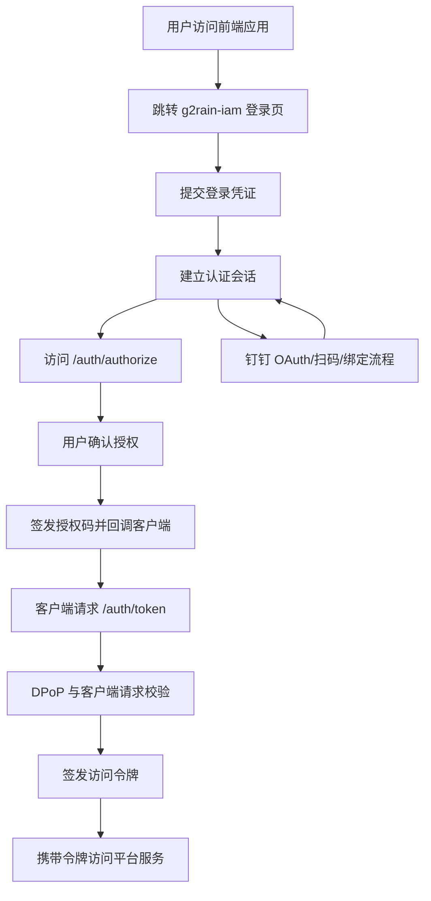



  

# g2rain-iam

下一代AI软件开发范式，AI原生Agent平台，开源的企业级SaaS底座。

统一身份认证与授权微服务，在浏览器侧提供登录、注册与授权确认等页面交互；在协议侧提供授权码换令牌与访问令牌发放能力，并结合 DPoP 执行令牌请求校验；通过 OpenFeign 调用 g2rain-basis-api 完成通行证、用户、应用等域数据协同

[官网](https://www.g2rain.com) · [Issues](https://github.com/g2rain/g2rain/issues) · [Discussions](https://github.com/g2rain/g2rain/discussions)

在 G2rain“企业级 AI 原生开源 SaaS 平台”体系中，`g2rain-iam` 位于平台核心服务层，承担统一身份入口与安全令牌中心的角色。

- 项目简介
- 平台定位
- 业务域说明
- 功能概览
- 使用场景
- 核心流程
- 流程图
- 技术栈
- 环境要求
- 快速开始
- 配置说明
- 构建与镜像
- 代码质量与测试
- 接口示例
- 安全说明
- 与关联仓库的关系
- 模块说明
- 职责边界
- 主要 HTTP 路径
- 常见问题
- 关联仓库
- 参与贡献
- 许可证
- 联系我们
- 致谢

## 项目简介

统一身份认证与授权微服务，在浏览器侧提供登录、注册与授权确认等页面交互；在协议侧提供授权码换令牌与访问令牌发放能力，并结合 DPoP 执行令牌请求校验；通过 OpenFeign 调用 g2rain-basis-api 完成通行证、用户、应用等域数据协同

## 平台定位

该仓库位于 g2rain 后端平台链路中，是统一认证与授权服务。 它与 g2rain-basis、g2rain-basis-api、g2rain-common、g2rain-gateway-webflux、g2rain-gateway-webmvc 在主数据访问与平台集成方面协同工作。 在协议层面，它负责签发授权码与访问令牌，而不只是一个页面级登录模块。 它还协调第三方身份提供方的接入与绑定流程。

本项目已在中央架构库登记为 `identity-security-service` 类型的 `platform-singleton`，是 G2rain 唯一统一身份安全服务；当前不创建空泛的通用 Profile。项目事实见 [docs/project.yaml](docs/project.yaml)，完整文档入口见 [docs/index.md](docs/index.md)。

## 业务域说明

该仓库聚焦于 `身份与访问控制`。

核心对象包括：
- 访问令牌
- 会话
- 身份提供方绑定
- 授权码
- 通行证
- 验证码
- 应用

主要流程包括：
- 凭证登录与已认证会话建立流程
- 授权确认与授权码签发流程
- 令牌签发、刷新与交换流程
- 通行证注册与验证码校验流程
- 钉钉 OAuth 登录与流式授权流程
- 钉钉通行证绑定流程
- 登出与会话清理流程

## 4. 核心能力

| 能力 | 说明 |
| --- | --- |
| 授权码流程 | GET /auth/authorize 校验会话并进入授权确认；POST /auth/authorize_selected 在确认后签发授权码并回调。 |
| 令牌端点 | POST /auth/token 提供令牌签发、刷新与交换能力。 对令牌端点额外执行 DPoP 相关校验。 |
| JWT 与密钥管理 | 基于 Nimbus JOSE JWT 处理令牌与密钥，支持从配置中心加载并切换签名密钥。 |
| 会话与缓存 | 结合 Redis 维护会话、授权码与登录态相关数据，并以统一键规则组织缓存内容。 |
| 页面交互 | 提供登录、注册、授权确认等浏览器侧页面入口，承接认证过程中的前端交互。 |
| 注册与验证码 | 提供通行证注册与注册验证码校验入口，支撑新用户或新凭证的接入流程。 |
| 第三方身份接入 | 支持钉钉登录、授权回调与通行证绑定等第三方身份提供方接入流程。 |
| 可观测性 | 暴露 Actuator 健康与信息端点，并引入追踪能力以便接入平台观测体系。 |

## 使用场景

| 场景 | 说明 |
| --- | --- |
| 统一登录入口 | 当平台需要为前端主应用、业务应用或管理端提供统一登录、登出与会话维护时使用。 |
| OAuth 授权码链路 | 当应用需要通过授权码换取访问令牌，并在平台服务间传递访问身份时使用。 |
| 第三方身份接入 | 当企业用户需要通过钉钉等身份提供方登录或绑定平台通行证时使用。 |
| 通行证注册 | 当平台需要开放注册、验证码校验和通行证创建流程时使用。 |

## 核心流程

| 流程 | 关键步骤 | 代码线索 |
| --- | --- | --- |
| 登录与会话建立 | 用户提交登录凭证 → 服务校验凭证并建立会话 → 浏览器侧获得后续授权流程所需的登录态 | POST /auth/login、AuthService、SessionService |
| 授权确认与授权码签发 | 客户端跳转到授权入口 → 服务校验会话并展示授权确认 → 用户确认后生成授权码并回调 redirect_uri | GET /auth/authorize、POST /auth/authorize_selected、AuthorizationService |
| 令牌签发与交换 | 客户端向令牌端点提交授权码或刷新参数 → 服务执行 DPoP 与客户端请求校验 → 服务签发或刷新访问令牌 | POST /auth/token、TokenService、ClientDPoPAuthFilter、TokenKeyProperties |
| 钉钉身份接入 | 用户发起钉钉授权或扫码登录 → 服务处理授权回调并解析身份信息 → 按需完成通行证绑定或登录态建立 | DingTalkOAuthController、DingTalkPassportBindController、IdpAuthService |

## 流程图

- 语言与运行时：`Java 25`
- 后端框架：`Spring Boot 4.0.5`、`Spring Cloud 2025.1.1`
- 服务治理：`Nacos Discovery`、`Nacos Config`
- 数据与缓存：`Redis`
- 服务调用：`OpenFeign`、`LoadBalancer`
- 安全与签名：`Nimbus JOSE JWT`、ECDSA、DPoP
- 页面渲染：`Thymeleaf`
- 可观测：`Actuator`、`OpenTelemetry`、`Micrometer Tracing`
- 构建与交付：`Maven`、`Jib`、`Dockerfile`、`build.sh`

| 类别 | 说明 |
| --- | --- |
| 运行时 | Java 25、Spring Boot 4.0.5、Spring Cloud 2025.1.1 |
| Web 视图 | Thymeleaf、thymeleaf-layout-dialect |
| 安全与令牌 | Nimbus JOSE JWT、g2rain-starter-aegis-core |
| 基础设施 | Redis、Nacos、OpenFeign、Spring Cloud LoadBalancer |
| 内部 API | g2rain-basis-api |
| 其他 | SpringDoc OpenAPI、Micrometer Tracing、OpenTelemetry、Lombok |

## 环境要求

- JDK 25+
- Maven 3.9+
- Redis
- Nacos
- 可访问的 g2rain-basis 服务

## 快速开始

| 步骤 | 命令或位置 | 说明 |
| --- | --- | --- |
| 准备运行环境 | JDK 25+、Maven 3.9+、Redis、Nacos | 后端服务启动前需要准备 Java 构建环境和平台依赖的基础设施。 |
| 调整配置 | `src/main/resources/application.yml` | 按需设置 SERVER_PORT、SPRING_PROFILES_ACTIVE、NACOS_SERVER_ADDR 等环境变量。 IAM 还需要根据实际身份接入场景配置 BASE_URL、PLATFORM_BASE_URL 及第三方身份参数。 |
| 构建项目 | `mvn clean package` | 执行 Maven 构建并生成可执行 Jar。 |
| 本地启动 | `mvn spring-boot:run` | 以当前 profile 启动服务，默认端口以 application.yml 中的 SERVER_PORT 为准。 |
| 验证服务 | `GET /actuator/health` | 服务启动后可通过健康检查确认运行状态。 |

版本号以项目构建配置为准，当前识别为 `1.0.0`。

## 配置说明

### 运行配置

| 配置项 | 说明 |
| --- | --- |
| `SERVER_PORT` | 默认 8082 |
| `SPRING_PROFILES_ACTIVE` | 默认 profile 为 dev |

### 平台集成配置

| 配置项 | 说明 |
| --- | --- |
| `NACOS_SERVER_ADDR` | 默认指向 127.0.0.1:8848，用于服务发现与配置中心连接 |

### 敏感配置

| 配置项 | 说明 |
| --- | --- |
| `spring.config.import` | 可选导入 g2rain-token-keypair.yml，用于加载令牌密钥等敏感配置 |
| `DINGTALK_*` | 钉钉身份接入相关客户端标识、密钥与企业信息，应通过安全配置渠道维护。 |

### 观测配置

| 配置项 | 说明 |
| --- | --- |
| `management.endpoints.web.exposure.include` | 默认暴露 health、info 等基础观测端点 |

### 接入配置

| 配置项 | 说明 |
| --- | --- |
| `BASE_URL` | IAM 对外访问基地址，用于登录、授权回调与第三方身份接入场景。 |
| `PLATFORM_BASE_URL` | 平台前端或控制台访问地址，用于认证完成后的页面跳转。 |

#### 1. 标准登录与授权码主线

| 目标 | 命令 | 产物 | 说明 |
| --- | --- | --- | --- |
| 可执行 Jar | `mvn clean package` | `g2rain-iam-1.0.0.jar` | 执行 Maven 标准构建，生成服务可执行产物。 |
| 本地运行 | `mvn spring-boot:run` | 本地 Spring Boot 进程 | 使用当前 profile 启动服务，便于本地联调。 |
| 容器镜像 | `mvn compile jib:dockerBuild` | 本地 Docker 镜像 | 通过 Jib 构建容器镜像，无需手写镜像构建流程。 |
| Dockerfile 镜像 | `docker build .` | 自定义 Docker 镜像 | 仓库提供 Dockerfile，可按组织镜像规范封装部署。 |
| 构建脚本 | `./build.sh` | 脚本定义的构建结果 | 仓库提供 build.sh，可承载组织内约定的镜像或发布流程。 |

- 客户端调用 `POST /auth/token` 时，`ClientDPoPAuthFilter` 会先校验客户端 `DPoP`。
- `TokenService` 再解析客户端身份、原子消费授权码，并读取登录上下文。
- 系统通过 `ApplicationClient` 获取平台登记的应用公钥，继续校验 `application-DPoP`。
- 在客户端 DPoP 与应用 DPoP 都通过后，`TokenKeyManager` 才会加载激活密钥并签发 JWT。
- 这一主线解决的是“请求来自哪个客户端实例、属于哪个应用、能否安全签发令牌”的企业级安全问题。

| 检查项 | 命令 | 说明 |
| --- | --- | --- |
| Maven Enforcer | `mvn validate` | 约束 JDK 版本、Maven 版本与依赖规则。 |
| Checkstyle | `mvn checkstyle:check` | 检查 Java 代码风格与组织规范。 |
| PMD | `mvn pmd:check` | 执行静态规则检查，识别潜在代码问题。 |
| SpotBugs | `mvn spotbugs:check` | 识别潜在缺陷和风险代码。 |
| JaCoCo | `mvn test jacoco:report` | 运行测试并生成覆盖率报告。 |

## 接口示例

| 示例 | 方法 | 路径 | 用途 | 调用示例 |
| --- | --- | --- | --- | --- |
| 提交登录 | POST | `/auth/login` | 提交登录凭证并建立认证会话。 | `curl -X POST http://localhost:8082/auth/login` |
| 发起授权 | GET | `/auth/authorize` | 进入授权确认流程，通常由浏览器跳转触发。 | `http://localhost:8082/auth/authorize?client_id=xxx&redirect_uri=xxx&response_type=code` |
| 换取令牌 | POST | `/auth/token` | 使用授权码、刷新参数或交换参数换取访问令牌。 | `curl -X POST http://localhost:8082/auth/token` |

## 安全说明

| 主题 | 说明 |
| --- | --- |
| 令牌密钥 | 令牌签名密钥通过配置中心导入，生产环境应使用安全配置渠道维护，不应提交到仓库。 |
| DPoP 校验 | 令牌端点存在 DPoP 请求校验逻辑，客户端接入时需要按协议提供证明材料。 |
| 会话 Cookie | 跨域或 HTTPS 部署时需要关注 SameSite、Secure 与回调域名配置，避免登录态不可用。 |
| 第三方身份密钥 | 钉钉客户端密钥、企业信息和回调地址属于敏感接入配置，应区分环境并避免泄露。 |

## 与关联仓库的关系

本仓库不直接承载用户、通行证、应用等主数据，而是作为认证体验与令牌发放服务，与 g2rain-basis 及 g2rain-basis-api 分工协作，完成主数据访问与认证链路闭环。

## 模块说明

| 模块 | 职责说明 | 代码线索 |
| --- | --- | --- |
| 登录与会话 | 处理登录、登出、会话建立与登录态维护。 | AuthService、SessionService、LoginController |
| 授权码流程 | 处理授权确认、授权码签发与授权回调。 | AuthorizeController、AuthorizationService |
| 令牌协议 | 处理令牌签发、刷新、交换与 DPoP 请求校验。 | TokenController、TokenService、ClientDPoPAuthFilter |
| 注册与验证码 | 处理通行证注册、验证码生成与注册校验流程。 | PassportController、CaptchaController、RegisterCaptchaService |
| 第三方身份接入 | 接入钉钉 OAuth、扫码登录、回调处理与通行证绑定。 | DingTalkOAuthController、DingTalkPassportBindController、IdpAuthService |
| 基础数据协同 | 通过内部 API 访问用户、应用、通行证等平台基础主数据。 | ApplicationClient、PassportClient、g2rain-basis-api |

## 职责边界

该仓库主要负责：
- 负责认证与授权流程
- 负责令牌相关协议流程处理
- 负责登录与会话交互流程
- 负责注册辅助交互流程
- 负责第三方身份提供方登录与绑定协同
- 通过 g2rain-basis 协同完成主数据读写

该仓库默认不负责：
- 不负责用户或应用的核心主数据
- 不是通行证与应用数据的唯一事实来源
- 不替代平台基础服务对用户、通行证与应用记录的持久化职责
- 不替代 g2rain-basis 的数据域职责

## 主要 HTTP 路径

| 方法 | 路径 | 说明 |
| --- | --- | --- |
| GET | /auth/{filename}.html | 通用认证页面渲染入口 |
| GET | /auth/authorize | 授权入口，校验会话并进入授权确认流程 |
| GET | /auth/captcha/register | 注册验证码获取入口 |
| GET | /auth/dingtalk/authorize | 钉钉授权发起入口 |
| GET | /auth/dingtalk/bind/passport/callback | 钉钉通行证绑定回调入口 |
| GET | /auth/dingtalk/callback | 钉钉授权回调入口 |
| GET | /auth/logout | 登出与会话清理入口 |
| GET | /auth/register.html | 注册页面渲染入口 |
| GET | /auth/wecom/authorize | 对外暴露的服务接口 |
| GET | /auth/wecom/callback | 对外暴露的服务接口 |
| POST | /auth/authorize_selected | 用户确认授权后生成授权码并执行回调 |
| POST | /auth/dingtalk/authorize_code | 钉钉授权码交换入口 |
| POST | /auth/dingtalk/bind/passport/start | 钉钉通行证绑定启动入口 |
| POST | /auth/dingtalk/qr/bootstrap | 钉钉扫码登录初始化入口 |
| POST | /auth/login | 登录提交入口 |
| POST | /auth/logout | 登出与会话清理入口 |
| POST | /auth/passport_register | 通行证注册入口 |
| POST | /auth/token | 令牌签发、刷新与交换入口 |
| POST | /auth/wecom/authorize_code | 对外暴露的服务接口 |

## 常见问题

| 问题 | 可能原因 | 处理建议 |
| --- | --- | --- |
| 服务无法注册或读取配置 | Nacos 地址、命名空间或账号配置不正确。 | 检查 NACOS_SERVER_ADDR 和 SPRING_CLOUD_NACOS_* 环境变量。 |
| 登录后回调失败 | BASE_URL、PLATFORM_BASE_URL 或第三方回调地址不一致。 | 确认 IAM 对外访问地址、平台前端地址和身份提供方回调配置一致。 |
| 令牌签发失败 | 令牌密钥配置未加载或 DPoP 请求材料不完整。 | 检查 g2rain-token-keypair.yml 导入和客户端 DPoP 参数。 |
| 会话状态异常 | Redis、Cookie SameSite/Secure 或跨域配置不满足当前部署方式。 | 确认 Redis 可用，并根据 HTTPS/跨域部署调整 Cookie 与域名配置。 |

## 关联仓库

| 仓库 | 协作关系 |
| --- | --- |
| g2rain-basis | 协同提供用户、应用、通行证等平台基础主数据能力。 |
| g2rain-basis-api | 通过内部 API 访问平台基础主数据与基础服务能力。 |
| g2rain-common | 复用平台公共规范、通用模型、工具能力或基础依赖约束。 |
| g2rain-gateway-webflux | 作为平台入口网关，协同完成请求转发、路由治理与入口安全控制。 |
| g2rain-gateway-webmvc | 作为 MVC 形态入口网关，协同完成请求转发、路由治理与入口安全控制。 |

- `pom.xml` 已集成 `maven-enforcer-plugin`、`checkstyle`、`pmd`、`spotbugs`、`jacoco`。
- 当前扫描未发现 `src/test/java` 测试源码，说明质量插件已接入，但自动化测试仍需补齐。
- 建议后续优先补齐授权码流程、DPoP 校验、JWT 签发、Session/Cookie 策略、钉钉登录回调等关键链路测试。

我们欢迎所有形式的贡献：Issue 反馈、文档改进、功能建议与代码提交。

推荐流程：

1. Fork 本仓库。
2. 创建特性分支：`git checkout -b feature/your-feature-name`。
3. 提交更改：`git commit -m "Add some feature"`。
4. 推送分支：`git push origin feature/your-feature-name`。
5. 提交 Pull Request。

代码贡献前请尽量补充必要的测试和文档，并确保构建、测试与静态检查通过。

## 12. 使用建议

本项目基于 [Apache 2.0许可证](https://github.com/g2rain/g2rain-common/blob/main/LICENSE) 开源。

## 工程文档

- [文档导航](docs/index.md)
- [项目元数据](docs/project.yaml)
- [架构偏差](docs/architecture/deviations.md)
- [配置与部署](docs/operations/configuration.md)
- [安全边界](docs/security/security-boundaries.md)
- [需求入口](docs/requirements/README.md)

## 联系我们

- Issues: [GitHub Issues](https://github.com/g2rain/g2rain/issues)
- 讨论: [GitHub Discussions](https://github.com/g2rain/g2rain/discussions)
- 邮箱: g2rain_developer@163.com

## 致谢

感谢所有为 g2rain 项目提交 Issue、代码、文档、建议和使用反馈的开发者们！
