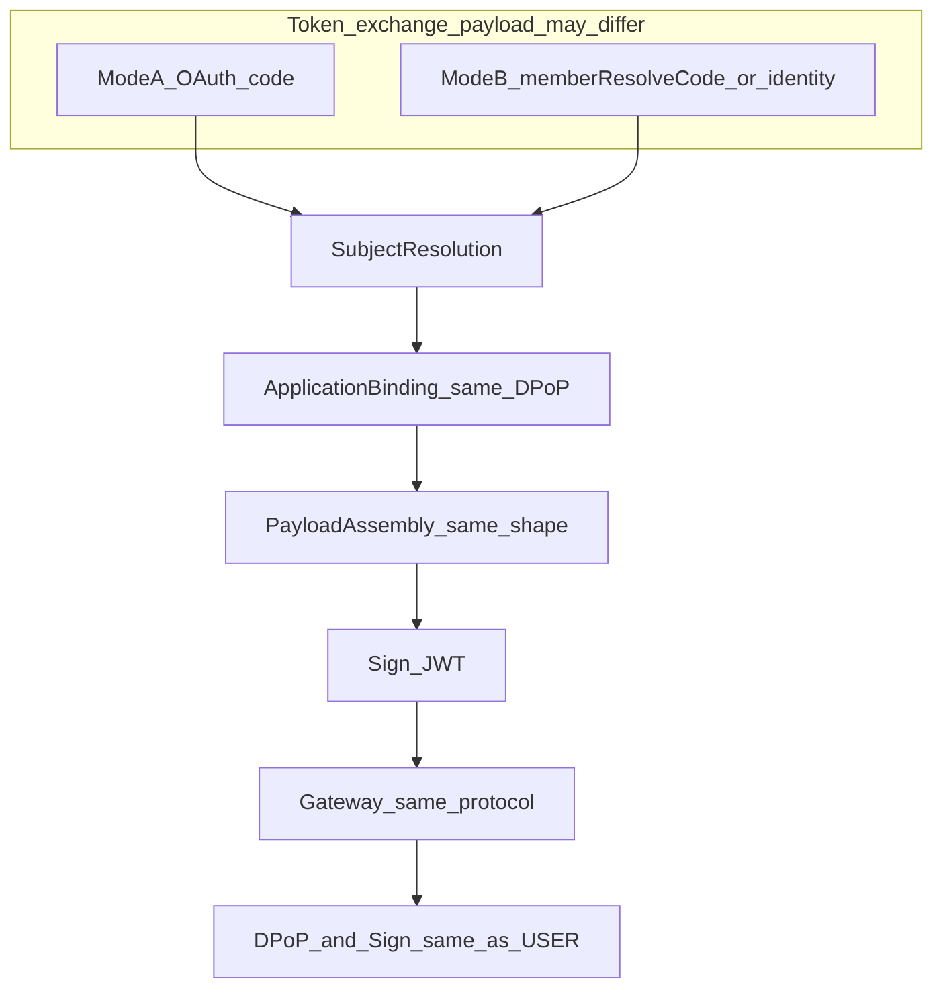

# Token 签发双模式对齐方案

状态：**已完成实施**（2026-09-15）  
范围：`g2rain-iam` 为主；连带 Gateway / Basis / Spring Boot Starter / 下游 Member（**不改** Common `isBackEnd` 定义，不新增后端调用参数）  
说明：平台侧 P0（签发、Gateway、Starter、Member 身份收口与文档）已落地；**客服模块客户端 DPoP 实现不在本仓范围，按调用方分期跟进**，不阻塞本方案结项。  
相关现状：[企业微信客服回调认证](./wecom-customer-service-callback-verification.md)、[企业微信能力地图](./wecom-capability-map.md)

## 1. 背景与问题

当前存在两种「换取访问 Token」的入口，但 **签发后的 Token 协议被拆成两套**：

| 模式 | 代表入口 | 换票负载（可不同） | 现状问题 |
| --- | --- | --- | --- |
| A. Code 换 Token | `POST /auth/token`（`authorization_code`） | OAuth 授权码 + Session / User | Client DPoP + Application DPoP；JWT 含 `applicationScopes`、`organType`、`clientPublicKey` 等；Gateway 走完整 DPoP/摘要 |
| B. 会员换票 | `POST /auth/member/token` | `memberResolveCode` + `externalUserId` 等 | JWT 仅三件套；**无**应用上下文、**无**客户端绑钥；Gateway 按 `SessionType=MEMBER` **跳过** DPoP/摘要 |

后果：

1. 合法 MEMBER 经 Gateway 后 `applicationId` 为空，现有 `isBackEnd() := applicationId == null` 将其判为后端（谓词本身不改；根因是未按统一协议写入应用上下文）。
2. 按调用方 / `SessionType` 特例跳过协议，导致以后 Web MEMBER 等通道还要再开分支，协议无法稳定。

## 2. 核心原则（评审已确认方向）

1. **不对任何调用方做协议特例**（含客服服务端、未来 Web、员工 App）。
2. **所有访问 Token 的使用协议相同**：Bearer 验签、DPoP（绑钥证明）、请求摘要、应用上下文写入、主体头重建——Gateway **不得**按 `SessionType` 或「是否客服」跳过。
3. **仅换票负载（SubjectResolution 入参）可以不同**：OAuth `code`、`memberResolveCode`、或后续身份字段等，只影响「凭什么签发」，不影响「签出来的票怎么用」。
4. Common `isBackEnd()` **保持** `applicationId == null`；不新增后端调用参数，不通过修改谓词或给 MEMBER 增加 `isBackEnd` 特例修复误判。
5. `memberId` 与 `userId` 分轨；MEMBER 不创建 passport（主体语义，不是协议减免）。
6. MEMBER 经 Gateway 进入下游前必须形成完整且合法的应用、租户和会员主体；任何协议字段缺失均失败关闭，不能以缺字段状态继续进入下游。
7. 下游从 `PrincipalContextHolder.getMemberId()` 读取可信会员身份，不增加可由请求参数承载的 MEMBER 身份注入参数。

## 3. 目标

1. 模式 A / B 共用同一套：ApplicationBinding（含 DPoP）→ PayloadAssembly → Sign → Gateway 消费。
2. MEMBER JWT 与员工 Token **同构到协议所需字段**（至少：`applicationScopes`、`organType`、`clientId`/`clientPublicKey` 绑钥、时间窗）；差别只在主体字段（`memberId` vs `userId`/`passportId`）。
3. 客服模块作为换票与持票客户端，**必须**满足与其它客户端相同的 Client DPoP + Application DPoP（换票）及每次请求 DPoP（经 Gateway）。
4. 取消 Gateway「MEMBER → 跳过 DPoP/摘要」；与员工同一过滤器路径写入 `applicationId`。
5. 换票仍不得信任客户端自报 `organId` 覆盖可信绑定。
6. Starter 的登录守卫显式识别合法 MEMBER 主体；修复后不能从“误判后端而放行”退化为“所有 MEMBER 请求均被拒绝”。
7. MEMBER 只能绑定租户类型机构；IAM 签发和 Gateway 消费均校验 `OrganType.isTenant(organType)`。
8. Gateway 对缺失或非法应用上下文失败关闭，不允许把 `applicationId == null` 的 MEMBER 主体透传到下游。

## 4. 非目标

- 修改 Common `isBackEnd()`，或按 `SessionType` 做特例。
- 新增显式 `backEnd` 请求参数、请求头或 MEMBER 专用后端调用参数。
- 保留或新增「某类调用方免 DPoP」的长期协议豁免。
- 一次性补齐 Basis 全量 MEMBER `resource_api` / 控制单元种子（可并行）。
- 改写 `wecom-customer-service-callback-verification.md` 已冻结的回调验签细节（实施时仅交叉更新 Token/§8.4 协议表述）。
- Nginx 直反代 Member；IAM→Member 内部解析方式变更。

## 5. 统一模型



### 5.1 阶段划分

| 阶段 | 是否允许因模式而异 | 模式 A | 模式 B（MEMBER） |
| --- | --- | --- | --- |
| SubjectResolution | **允许** | 消费 OAuth 授权码 → Session / User | 消费 `memberResolveCode`（+ `externalUserId` 等）→ 可信 `organId` + Member resolve → `memberId` |
| ApplicationBinding | **不允许减免** | Client DPoP（`kid`/`acd`）+ Application DPoP + Basis 应用校验 | **同一套** Client DPoP + Application DPoP；`acd` 为客服入口应用编码 |
| PayloadAssembly | 主体字段可不同，协议字段须齐 | `fetchTokenContext` 等 | `fetchMemberTokenContext`（或等价）+ 填 `memberId`；须含 scopes、organ*、**clientPublicKey** |
| Sign | 同一路径 | `doGenerateToken` | 同一签名路径；禁止手写三件套直签 |
| Gateway 使用 | **不允许减免** | Token 验签 → DPoP → 摘要 → 权限 → 转发 | **同一顺序与校验**；删除 `SessionType.isMember` 跳过分支 |

### 5.2 换票负载（唯一允许分叉处）

近期对外契约仍可为：

```text
POST /auth/member/token
  Headers: Client DPoP、Application DPoP（与 /auth/token 同协议要求）
  Body: memberResolveCode + externalUserId (+ profile/msgid)
```

与 `POST /auth/token` 的差异仅在：grant/body 如何证明主体；**不**在是否携带 DPoP。

后续若增加「纯身份换票」入口：仍只换 SubjectResolution 入参，后半段与 Gateway 协议不变。

## 6. MEMBER 载荷契约（目标态）

| Claim / 字段 | 规则 |
| --- | --- |
| `sessionType` | `MEMBER` |
| `memberId` / `organId` | 必填；**不得**写 `userId` / `passportId` |
| `applicationScopes` | 与员工 Token 同结构；至少含入口应用 |
| `organType` / `organName` | 来自 Basis 机构主数据；`organType` 必须满足 `OrganType.isTenant(...)`，非租户类型拒绝签发 |
| `adminCompany` / `adminUser` | MEMBER 固定 false（除非产品另有定义） |
| `clientId` / `clientPublicKey` | **必填**（换票时 Client DPoP 绑定）；供 Gateway 校验持有者 |
| 时间窗 | `issuedAt` / `expireAt`（及平台约定的 refresh 字段策略） |

签发前：Member 状态允许 + 应用/`acd` 合法 + 机构可用且为租户类型 + DPoP 校验通过。

建议 Basis：`fetchMemberTokenContext(organId, applicationCode)` 产出与员工上下文同级的骨架（sessionType=MEMBER、organ*、scopes、TTL）；IAM 填 `memberId`/`name` 并写入绑钥字段后签名。

硬编码日志用 `"member"` **不得**代替 JWT 内真实 `applicationCode`。

## 7. Gateway 与 `isBackEnd`

### 7.1 Gateway（WebFlux + WebMVC）

- **删除**（或视为缺陷）`SessionType.MEMBER` → 跳过 `GatewayDPoPAuthFilter` / `SignVerificationFilter` 的逻辑。
- MEMBER 与 USER/PASSPORT：**同一** Token 验签 → DPoP（含与 Token 绑钥、`acd`∈scopes、`htm`/`htu`/`jti`）→ 摘要 → `MemberPerm`（入口权限仍按 MEMBER 规则）→ `PrincipalForwardFilter`。
- `applicationId` 写入路径与员工一致（由现有 DPoP/`acd`→scope 解析完成），**不为 MEMBER 另写一套「免 DPoP 只塞 scopes」旁路**。
- 无绑钥、无 scopes、`acd` 无匹配 scope、scope 缺失/非法 `applicationId`、DPoP 失败：与其它会话相同，在 `PrincipalForwardFilter` 前拒绝。
- 匹配到的 `scope.applicationId`、`scope.applicationOrganId` 必须为合法正数；不得依赖后续 `isBackEnd()` 或权限过滤器兜底。
- MEMBER JWT 的 `organType` 必须满足 `OrganType.isTenant(...)`；`organId`、`memberId` 必须为正数，且不得混入 `userId` / `passportId`。
- WebFlux 与 WebMVC 必须执行相同的字段校验和失败关闭规则，不允许任一实现以 `return` / `Mono.empty()` 静默跳过上下文构建后继续请求。

### 7.2 Common `isBackEnd`（不变）

```text
isBackEnd() := applicationId == null
```

统一协议下 MEMBER 经 Gateway 后必有 `applicationId` ⇒ 自然为 false。旧无绑钥/无 scopes 的 MEMBER Token：拒绝，不靠改谓词兼容。

保持该定义的前提是 Gateway 建立并强制执行如下安全不变量：

```text
任何被 Gateway 转发到下游的 MEMBER 请求
  => applicationId != null && applicationId > 0
  => applicationOrganId != null && applicationOrganId > 0
  => OrganType.isTenant(organType)
  => organId != null && organId > 0
  => memberId != null && memberId > 0
  => userId == null && passportId == null
```

任一条件不满足时必须在 Gateway 内拒绝，不能携带不完整 Principal 进入下游。Common 的 MEMBER 公共契约需同步补充“经 Gateway 的访问 Token 必须具有合法应用上下文”这一约束，但不修改 `isBackEnd()` 实现，也不增加新的后端调用参数。

### 7.3 Spring Boot Starter 登录守卫

`applicationId` 补齐后，MEMBER 的 `isBackEnd()` 为 `false`，请求会进入 `LoginGuardInterceptor` 的会话校验。当前 Starter 仅识别 USER、PASSPORT 和 ANONYMOUS，必须增加 MEMBER 登录成功条件：

```text
SessionType.isMember(sessionType)
  && memberId != null
  && memberId > 0
```

缺少、零值或负值 `memberId` 均拒绝。该逻辑只确认 MEMBER 已认证，不赋予员工角色或数据权限，也不新增 Controller 请求参数。

### 7.4 下游租户隔离与 memberId 使用

- IAM 签发和 Gateway 验证均要求 `OrganType.isTenant(organType)`，确保现有 MyBatis 数据隔离处理器进入租户分支。
- 数据隔离继续以可信 `organId` 为边界；MEMBER 不进入依赖 `userId` / 员工角色的数据权限模型。
- 下游需要当前会员身份时，直接使用 `PrincipalContextHolder.getMemberId()`；不得从 Query、Body、Path 或普通请求参数相信 `memberId`。
- 本方案不为 `IdentityInject` 增加 `memberIdPropertyName`，也不新增其他 MEMBER 身份参数。若业务 DTO 同时含 `memberId`，Service 必须以 Principal 中的值覆盖或进行严格相等校验。
- 对象级操作必须同时校验资源所属 `organId` 与当前 Principal `organId`，并在业务要求资源归属具体会员时校验资源 `memberId` 与 Principal `memberId`。

## 8. 一致性清单

| 检查项 | 模式 A | 模式 B（目标） |
| --- | --- | --- |
| 换票负载 | OAuth code 等 | `memberResolveCode` + 身份字段等 |
| Client + Application DPoP（换票） | 有 | **有（相同）** |
| scopes / organType / 绑钥入 JWT | 有 | **有（相同）** |
| Gateway DPoP + 摘要 | 有 | **有（相同）** |
| 网关 applicationId | DPoP/`acd` 路径 | **同一路径** |
| Gateway 缺应用上下文 | 拒绝 | **拒绝；不得透传为空后由 isBackEnd 兜底** |
| Starter LoginGuard | USER/PASSPORT 既有规则 | **MEMBER + 正数 memberId** |
| 租户隔离 | 按 organType / organId | **organType 必须为租户类型，按可信 organId** |
| 当前主体 ID 使用 | `userId` / `passportId` | **仅从 PrincipalContextHolder 读取 memberId** |
| 入口 API 权限模型 | UserPerm 等 | MemberPerm（**授权数据**分轨，**不是**协议减免） |
| isBackEnd | 有 app → false | 有 app → false |

说明：`MemberPerm` vs `UserPerm` 是「允许访问哪些 API」的授权策略差异，属于产品权限模型；**不**等于可以减免 DPoP/摘要/应用绑定。

## 9. 实施分期

### P0 — 协议统一 + 消除空 applicationId

1. [x] IAM：`/auth/member/token` 要求并校验 Client/Application DPoP；统一 PayloadAssembly；JWT 含 scopes、organ*、client 绑钥。
2. [ ] 客服模块：实现与其它客户端相同的 DPoP 换票与请求证明（密钥托管、多实例策略需评审落地）— **外仓/调用方分期，不阻塞本方案结项**。
3. [x] Gateway：去掉 MEMBER 跳过 DPoP/摘要；补齐应用 scope、正数 applicationId/applicationOrganId、租户 organType 和 MEMBER claim 的失败关闭校验。
4. [x] Spring Boot Starter：`LoginGuardInterceptor` 增加 MEMBER + 正数 memberId 的认证分支；不增加身份注入参数。
5. [x] 下游 Member：`PrincipalContextHolder.getMemberId()` 收口，organId + memberId 对象级授权。
6. [x] 单测：相关仓单元测试已覆盖签发收口、LoginGuard、Member 对象级拒绝等（客服端到端联调随客户端 DPoP 落地）。
7. [x] 文档：Common MEMBER 契约、客服回调 §8.4、Gateway `member-session-gateway` 等已去掉「MEMBER 跳过 DPoP」表述。

### P1 — 可选换票负载扩展

- 纯身份换票等：仅扩展 SubjectResolution；协议后半段零分叉（未排期）。

## 10. 配置与密钥

- 客服入口 `applicationCode` 与 Application DPoP 公钥：配置/Basis 主数据，与员工应用同一套描述符模型。
- 客服 Client 钥：多实例共用或每实例一把 + 禁止跨钥复用 Token；轮换与 Token 缓存失效策略写进运维说明。
- 禁止 Token/私钥/code 进日志。

## 11. 测试与验收

| 用例 | 期望 |
| --- | --- |
| `/auth/member/token` 无 Client/Application DPoP | 拒绝 |
| 换票成功 | JWT 含 MEMBER 主体 + scopes + organType + clientPublicKey |
| 换票得到非租户 `organType` | 拒绝签发 |
| Gateway MEMBER 无 DPoP | 拒绝（与员工无 DPoP 一致） |
| Gateway MEMBER 完整协议 | `applicationId` 非空；`isBackEnd()==false`；MemberPerm 仍按 organ 生效 |
| Gateway scope 缺少/非法 applicationId | 在主体透传前拒绝，不进入下游 |
| Gateway MEMBER 使用非租户 organType | 拒绝 |
| Starter LoginGuard + 合法 MEMBER | `memberId > 0` 时放行 |
| Starter LoginGuard + 非法 MEMBER | memberId 缺失、零值或负值时拒绝 |
| MEMBER 访问租户数据 | SQL 附加可信 organId 隔离条件 |
| MEMBER 伪造请求 memberId | 下游忽略、覆盖或拒绝；只使用 PrincipalContextHolder 中的 memberId |
| MEMBER 跨会员/跨租户访问对象 | 拒绝 |
| 员工 `authorization_code` | 回归不变 |
| Common `isBackEnd` | **无变更** |

## 12. 风险与开放问题

1. 客服多实例 Client 钥与 `(organId, externalUserId)` Token 复用如何对齐。
2. `htu` 规范化（已知 IAM-002/Gateway 代理偏差）在客服高 QPS 下必须先修或明确外部 URL 约定。
3. 旧无 DPoP 的 MEMBER Token：短 TTL 淘汰或一律 401。
4. 入口 `applicationCode` 与租户开通校验粒度。
5. Common 仍以缺少 `applicationId` 判定后端调用，因此 Gateway 对 MEMBER 应用上下文的失败关闭属于发布阻断项；不得以部署约定替代自动化负向测试。

## 13. 评审结论栏

- [x] 同意：**Token 使用协议全局统一；仅换票负载可分叉**  
- [x] 同意：客服服务端也走 Client/Application DPoP + 请求 DPoP（无调用方豁免；客户端实现外仓分期）  
- [x] 同意：Gateway 删除 MEMBER 跳过 DPoP/摘要  
- [x] **`isBackEnd()` 保持不变；不对 MEMBER 特例**  
- [x] **不新增显式 backEnd 参数、请求头或 MEMBER 身份注入参数**  
- [x] 同意：Gateway 对 MEMBER 缺失/非法应用上下文和非租户 organType 失败关闭  
- [x] 同意：Starter LoginGuard 增加 MEMBER + 正数 memberId 分支  
- [x] 同意：下游只从 PrincipalContextHolder 读取当前 memberId，并执行 organId + memberId 对象级授权  
- [ ] 确认客服 Client 钥与 Token 复用策略（外仓跟进）  
- [x] 平台侧实施完成；`aiCoding.activeRequirement` 已清空